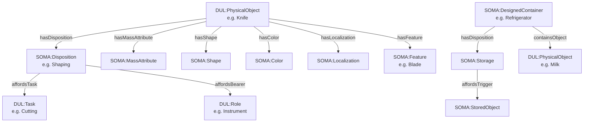

# Analisi SOMA-HOME.owl per Commonsense Reasoning Robotico
## Task di riferimento: *Tidy Up* e *Tool Usage*

> [!NOTE]
> Tutte le URI hanno il prefisso base:
> - **SOMA**: `http://www.ease-crc.org/ont/SOMA.owl#`
> - **DUL**: `http://www.ontologydesignpatterns.org/ont/dul/DUL.owl#`
> - **SOMA-HOME**: `http://www.ease-crc.org/ont/SOMA-HOME.owl#`

---

## PARTE 1 — Object Properties (Le Relazioni)

### 1.1 Affordance e proiezione su Task/Role

| Proprietà | URI (suffix SOMA) | Dominio | Range | Uso pratico |
|-----------|-------------------|---------|-------|-------------|
| **`hasDisposition`** | `#hasDisposition` | `DUL:Object` | `SOMA:Disposition` | Collega un oggetto fisico alla sua disposizione (es. un coltello → `Shaping`). **Usa per**: ConceptNet `UsedFor → cutting food` → `knife hasDisposition ShapingDisposition` |
| **`affordsTask`** | `#affordsTask` | `SOMA:Disposition` | `DUL:Task` | Collega la disposizione al task che essa permette. **Usa per**: `ShapingDisposition affordsTask Cutting` |
| **`affordsConcept`** | `#affordsConcept` | `SOMA:Disposition` | `DUL:Concept` | Collegamento generico disposizione→concetto (sopraproprietà di `affordsTask`). |
| **`affordsBearer`** | `#affordsBearer` | `SOMA:Disposition` | `DUL:Role` | Collega la disposizione al ruolo del portatore (es. il coltello ha ruolo `Instrument`). |
| **`affordsTask`** (tramite chain) | Axiom: `isDescribedBy ∘ affordanceDefinesTask` | `SOMA:Disposition` | `DUL:Task` | Property chain automatica: `oggetto → hasDisposition → Disposition → affordsTask → Task` |

#### Pattern di traduzione affordance:
```
ConceptNet: Knife UsedFor cutting
→ SOMA:Knife hasDisposition SOMA:ShapingDisposition
→ SOMA:ShapingDisposition affordsTask SOMA:Cutting
→ SOMA:Knife affordsTask SOMA:Cutting  [via chain]
```

---

### 1.2 Qualità Fisiche Intrinseche

| Proprietà | URI (suffix SOMA) | Dominio | Range | Uso pratico |
|-----------|-------------------|---------|-------|-------------|
| **`hasShape`** | `#hasShape` | `DUL:PhysicalObject` | `SOMA:Shape` | Collega oggetto → qualità forma. **Usa per**: `tin foil hasShape FlatShape` |
| **`hasShapeRegion`** | `#hasShapeRegion` | `SOMA:Shape ∪ DUL:PhysicalObject` | `SOMA:ShapeRegion` | Collega a una Shape Region concreta (es. `CylinderShape`, `BoxShape`). |
| **`hasColor`** | `#hasColor` | `DUL:PhysicalObject` | `SOMA:Color` | Collega oggetto → qualità colore. |
| **`hasMassAttribute`** | `#hasMassAttribute` | `DUL:PhysicalObject` | `SOMA:MassAttribute` | **Chiave per peso**. `heavy kettle hasMassAttribute MassAttribute(heavy)`. Usa per ConceptNet `HasProperty → heavy`. |
| **`hasLocalization`** | `#hasLocalization` | `DUL:PhysicalObject` | `SOMA:Localization` | Collega oggetto alla sua qualità di localizzazione (posizione attuale). |
| **`hasSpaceRegion`** | `#hasSpaceRegion` | `SOMA:Localization ∪ SOMA:ShapeRegion ∪ DUL:PhysicalObject` | `DUL:SpaceRegion` | Collega una localizzazione/shape a una regione spaziale concreta. |
| **`hasFrictionAttribute`** | `#hasFrictionAttribute` | `DUL:PhysicalObject` | `SOMA:FrictionAttribute` | Proprietà di attrito (rilevante per afferrabilità). Utile per task di grasping. |
| **`hasQuale`** | `#hasQuale` | `DUL:Quality` | `DUL:Region` | Relazione valore-qualità (es. una `Temperature` hasQuale un valore nella `TemperatureRegion`). |

---

### 1.3 Spazio e Contenimento (per Tidy Up)

| Proprietà | URI (suffix SOMA) | Dominio | Range | Uso pratico |
|-----------|-------------------|---------|-------|-------------|
| **`containsObject`** | `#containsObject` | `DUL:PhysicalObject` | `DUL:PhysicalObject` | *Transitiva*. "Il frigorifero contiene il latte". Tidy Up: `Refrigerator containsObject Milk`. |
| **`isInsideOf`** | `#isInsideOf` | `DUL:PhysicalObject` | `DUL:PhysicalObject` | Inversa di `containsObject`. `Milk isInsideOf Refrigerator`. |
| **`isPhysicallyContainedIn`** | `#isPhysicallyContainedIn` | – | – | Relazione più specifica di contenimento fisico (sottoproprietà di `isContainedIn`). |
| **`coversObject`** | `#coversObject` | `DUL:PhysicalObject` | `DUL:PhysicalObject` | Un oggetto che copre/protegge un altro (es. un coperchio). Utile per modellare "tin foil coversObject food". |

---

### 1.4 Feature e Componenti Funzionali (per Tool Usage)

| Proprietà | URI (suffix SOMA) | Dominio | Range | Uso pratico |
|-----------|-------------------|---------|-------|-------------|
| **`hasFeature`** | `#hasFeature` | `DUL:PhysicalObject` | `SOMA:Feature` | Collega un oggetto a una sua feature fisica (es. il bordo affilato di un coltello è una `Blade`). |
| **`interactsWith`** | `#interactsWith` | `DUL:PhysicalObject` | `DUL:PhysicalObject` | *Simmetrica*. Modella interazione fisica tra oggetti durante un'azione. |
| **`involvesEffector`** | `#involvesEffector` | `DUL:Event` | `SOMA:PhysicalEffector` | Collega un evento al manipolatore fisico (mano/pinza) che lo esegue. |
| **`describesQuality`** | `#describesQuality` | `DUL:Description` | `DUL:Quality` | Un'Affordance/Description descrive una qualità. Utile per legare affordance a qualità fisiche. |

---

### 1.5 Relazioni da DUL ereditate e rilevanti

| Proprietà | URI (suffix DUL) | Note |
|-----------|-----------------|------|
| `DUL:hasQuality` | `DUL#hasQuality` | Superproprietà di `hasShape`, `hasColor`, `hasLocalization`. |
| `DUL:isDescribedBy` | `DUL#isDescribedBy` | Lega un oggetto a un'Affordance che lo descrive. |
| `DUL:classifies` | `DUL#classifies` | Un Task classifica un'Azione. |
| `DUL:isLocationOf` / `DUL:hasLocation` | `DUL#isLocationOf` | Relazione spaziale generale (superproprietà di containsObject). |

---

## PARTE 2 — Classes (I Nodi di Destinazione)

### 2.1 Task (Compiti) — Sottoclassi di `DUL:Task`

| Classe | URI (suffix SOMA) | Superclasse | Descrizione + Uso pratico |
|--------|-------------------|-------------|---------------------------|
| **`Cutting`** | `#Cutting` | `SOMA:ModifyingPhysicalObject` | Separare pezzi da un target. **ConceptNet `Knife UsedFor cutting food` → `Knife affordsTask Cutting`** |
| **`Slicing`** | `#Slicing` | `SOMA:Cutting` | Tagliare in fette (es. pane, carne). Sottoclasse specifica di Cutting. |
| **`Mixing`** | `#Mixing` | – | Mescolare ingredienti. |
| **`Stirring`** | `#Stirring` | `SOMA:Mixing` | Sciogliere particelle in fluido. `Spoon affordsTask Stirring`. |
| **`Pouring`** | `#Pouring` | – | Versare liquidi. `Jug/Bottle affordsTask Pouring`. |
| **`PouringInto`** | `#PouringInto` | `SOMA:Pouring` | Versare *dentro* un contenitore. |
| **`PouringOnto`** | `#PouringOnto` | `SOMA:Pouring` | Versare *sopra* una superficie. |
| **`Grasping`** | `#Grasping` | `SOMA:PhysicalTask` | Afferrare un oggetto. Base per Tool Usage. |
| **`PickingUp`** | `#PickingUp` | – | Raccogliere un oggetto dal piano. Task fondamentale per Tidy Up. |
| **`Placing`** | `#Placing` | – | Posizionare un oggetto in una posizione target. Task fondamentale per Tidy Up. |
| **`Transporting`** | `#Transporting` | – | Spostare un oggetto da A a B. Include PickingUp + Placing. |
| **`Fetching`** | `#Fetching` | – | Recuperare un oggetto e portarlo a destinazione. |
| **`Cleaning`** | `#Cleaning` | – | Pulire un oggetto o superficie. |

> [!TIP]
> Per Tidy Up, il workflow SOMA è: `Fetching → PickingUp → Transporting → Placing`, con `Destination` e `StoredObject` come ruoli chiave.

---

### 2.2 Classi di Disposizione (collegano oggetto → capacità)

| Classe | URI (suffix SOMA) | Superclasse | Descrizione + Uso pratico |
|--------|-------------------|-------------|---------------------------|
| **`Disposition`** | `#Disposition` | `SOMA:Extrinsic` | *Classe astratta*. La tendenza di un oggetto a fare accadere certi eventi con altri. Ogni tool ha almeno una Disposition. |
| **`Storage`** | `#Storage` | `SOMA:Enclosing` | **Disposizione di contenimento/conservazione**. "La disposizione di un contenitore a conservare oggetti". `Refrigerator hasDisposition Storage`. |
| **`Shaping`** | `#Shaping` | – | Disposizione a modificare la forma (es. coltello, forbici). `CuttingTool hasDisposition Shaping`. |

---

### 2.3 Role (Ruoli degli oggetti nell'evento)

| Classe | URI (suffix SOMA/DUL) | Superclasse | Descrizione + Uso pratico |
|--------|----------------------|-------------|---------------------------|
| **`Instrument`** | `SOMA#Instrument` | `SOMA:ResourceRole` | Ruolo dell'oggetto usato per eseguire l'evento. **ConceptNet `UsedFor` → oggetto ha ruolo `Instrument`** nel task corrispondente. |
| **`StoredObject`** | `SOMA#StoredObject` | `SOMA:EnclosedObject` | Ruolo dell'oggetto che viene conservato. `Milk isA StoredObject [in Refrigerator]`. |
| **`Container`** | `SOMA#Container` | `DUL:Role` | Ruolo dell'entità che funge da contenitore durante un evento di contenimento. |
| **`Destination`** | `SOMA#Destination` | `SOMA:Location` | Ruolo della posizione di arrivo in un task di spostamento. Usato in Placing/Transporting. |
| **`AlteredObject`** | `SOMA#AlteredObject` | – | Ruolo dell'oggetto modificato (es. il cibo che viene tagliato durante `Cutting`). |
| **`ResourceRole`** | `SOMA#ResourceRole` | `DUL:Role` | Classe padre per ruoli di strumenti/risorse. |

---

### 2.4 Physical Qualities (Qualità Fisiche) — Sottoclassi di `SOMA:PhysicalQuality`

| Classe | URI (suffix SOMA) | Superclasse | Descrizione + Uso pratico |
|--------|-------------------|-------------|---------------------------|
| **`PhysicalQuality`** | `#PhysicalQuality` | `DUL:Quality` | *Classe padre*. "Qualsiasi aspetto di un'entità dipendente dalla sua manifestazione fisica". |
| **`Color`** | `#Color` | – | Qualità del colore. `Object hasColor Color`. |
| **`Shape`** | `#Shape` | – | Qualità della forma. `Object hasShape Shape`. Include sottoclassi come `CylinderShape`, `BoxShape`. |
| **`MassAttribute`** | `#MassAttribute` | – | Peso/massa dell'oggetto. **ConceptNet `HasProperty → heavy` → `Object hasMassAttribute MassAttribute(heavy)`**. Rilevante per Tool Usage (oggetti pesanti da sollevare). |
| **`Temperature`** | `#Temperature` | – | Qualità termica. **Fondamentale per Tidy Up**: il latte deve stare al fresco → `Milk hasQuality Temperature(perishable)` → `Refrigerator isAppropriateStorageFor Milk`. |
| **`FrictionAttribute`** | `#FrictionAttribute` | – | Attributo di attrito. Rilevante per grasping (superficie scivolosa/ruvida). |
| **`Localization`** | `#Localization` | `SOMA:PhysicalQuality` | Qualità di localizzazione (posizione). `Object hasLocalization Localization(at: Refrigerator)`. |

---

### 2.5 Classi Fisiche Domestiche (Artefatti e Contenitori)

| Classe | URI (suffix SOMA) | Superclasse | Descrizione + Uso pratico |
|--------|-------------------|-------------|---------------------------|
| **`DesignedContainer`** | `#DesignedContainer` | `DUL:DesignedArtifact` | Oggetto progettato per contenere altri. Superclasse di Bottle, Bowl, Box, Refrigerator, Cupboard, Drawer, ecc. |
| **`DesignedTool`** | `#DesignedTool` | `DUL:DesignedArtifact` | Oggetto progettato per abilitare un'azione (ha ruolo strumentale). Superclasse di CuttingTool, ecc. |
| **`Refrigerator`** | `#Refrigerator` | `SOMA:DesignedContainer` | Frigorifero. `Refrigerator hasDisposition Storage`. Destinazione naturale per alimenti deperibili. |
| **`FreezerCompartment`** | `#FreezerCompartment` | – | Scomparto del congelatore. |
| **`Cupboard`** | `#Cupboard` | `SOMA:DesignedContainer` | Credenza/armadietto. Destinazione per stoviglie, cibi non deperibili. |
| **`Drawer`** | `#Drawer` | `SOMA:DesignedContainer` | Cassetto. Destinazione per utensili da cucina. |
| **`Bottle`** | `#Bottle` | `SOMA:DesignedContainer` | Bottiglia. |
| **`Bowl`** | `#Bowl` | `SOMA:DesignedContainer` | Ciotola. |
| **`Box`** | `#Box` | `SOMA:DesignedContainer` | Scatola. |
| **`CuttingTool`** | `#CuttingTool` | `SOMA:DesignedTool` | Utensile da taglio. Definito per avere `hasDisposition Shaping`. |
| **`Blade`** | `#Blade` | `SOMA:Feature` | Feature di un CuttingTool (la lama). `Knife hasFeature Blade`. |
| **`Appliance`** | `#Appliance` | – | Elettrodomestico. Superclasse di Stove, ecc. |

---

### 2.6 Classi per Stato Fisico e Contenimento

| Classe | URI | Uso pratico |
|--------|-----|-------------|
| **`Containment`** | `SOMA#Containment` | Description che modella il contenimento (quale oggetto è contenuto in quale). |
| **`ContainmentState`** | `SOMA#ContainmentState` | Stato fisico in cui un oggetto è contenuto in un DesignedContainer. |
| **`PhysicalState`** | `SOMA#PhysicalState` | Stato fisico generico (es. aperto/chiuso, caldo/freddo). |

---

## PARTE 3 — Pattern di Traduzione ConceptNet → SOMA

### Pattern A: Tool Usage (UsedFor)

```
ConceptNet: Knife UsedFor cutting food
SOMA Translation:
  SOMA:Knife  a  DUL:DesignedArtifact, SOMA:CuttingTool .
  SOMA:Knife  SOMA:hasDisposition  soma:knife_shaping_disposition .
  soma:knife_shaping_disposition  a  SOMA:Shaping .
  soma:knife_shaping_disposition  SOMA:affordsTask  SOMA:Cutting .
  [chain] SOMA:Knife  SOMA:affordsTask  SOMA:Cutting .
```

```
ConceptNet: Spoon UsedFor stirring soup
SOMA Translation:
  SOMA:Spoon  SOMA:hasDisposition  soma:spoon_mixing_disp .
  soma:spoon_mixing_disp  a  SOMA:Disposition .
  soma:spoon_mixing_disp  SOMA:affordsTask  SOMA:Stirring .
```

### Pattern B: Tidy Up — AtLocation / StoredAt

```
ConceptNet: Milk AtLocation Refrigerator
SOMA Translation:
  SOMA:Milk  a  DUL:PhysicalObject .
  SOMA:Refrigerator  a  SOMA:DesignedContainer .
  SOMA:Refrigerator  SOMA:hasDisposition  soma:fridge_storage_disp .
  soma:fridge_storage_disp  a  SOMA:Storage .
  SOMA:Milk  SOMA:isInsideOf  SOMA:Refrigerator .    [ABox: stato attuale]
  [Regola] Se X IsPerishable AND X NeedsStorage → X isInsideOf Refrigerator
```

```
ConceptNet: Scissors UsedFor cutting paper
SOMA Translation:
  SOMA:Scissors  a  SOMA:CuttingTool .
  SOMA:Scissors  SOMA:hasDisposition  soma:scissors_shaping_disp .
  soma:scissors_shaping_disp  SOMA:affordsTask  SOMA:Cutting .
```

### Pattern C: Physical Properties (HasProperty)

```
ConceptNet: Aluminum IsA Material, UsedFor food storage
SOMA Translation:
  soma:AluminumFoil  a  DUL:PhysicalObject .
  soma:AluminumFoil  SOMA:hasDisposition  soma:alu_storage_disp .
  soma:alu_storage_disp  a  SOMA:Storage .
  soma:alu_storage_disp  SOMA:affordsTask  SOMA:Enclosing .
  soma:AluminumFoil  SOMA:coversObject  soma:Food .   [affordance: covering]

ConceptNet: Kettle HasProperty heavy
SOMA Translation:
  SOMA:Kettle  SOMA:hasMassAttribute  soma:heavy_mass_attr .
  soma:heavy_mass_attr  a  SOMA:MassAttribute .
  [inferisce] SOMA:Kettle  requiresGraspType  SOMA:PowerGrasp .
```

---

## Riepilogo Visuale: Catena di Inferenza Principale


